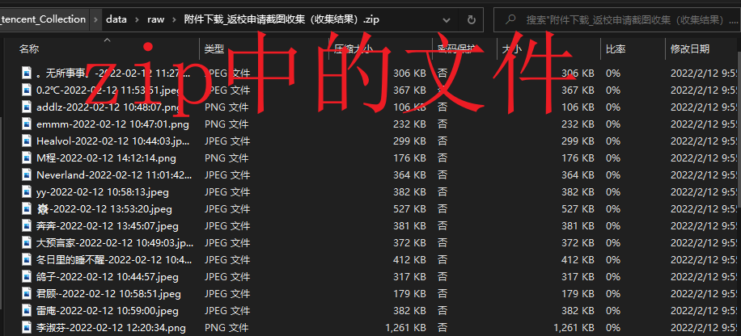
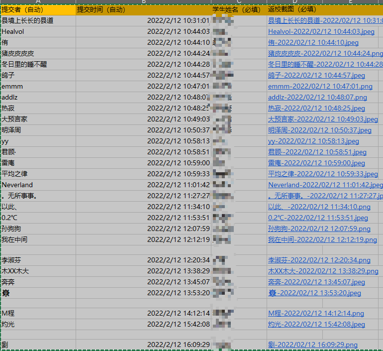
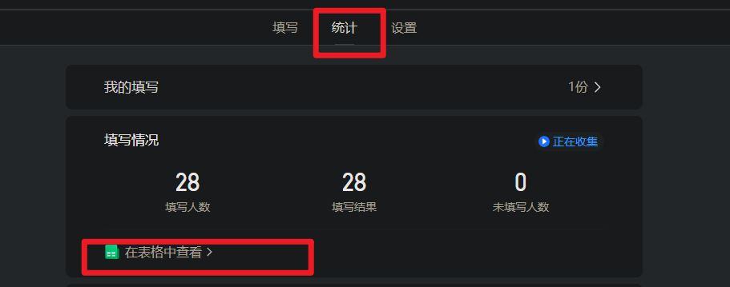
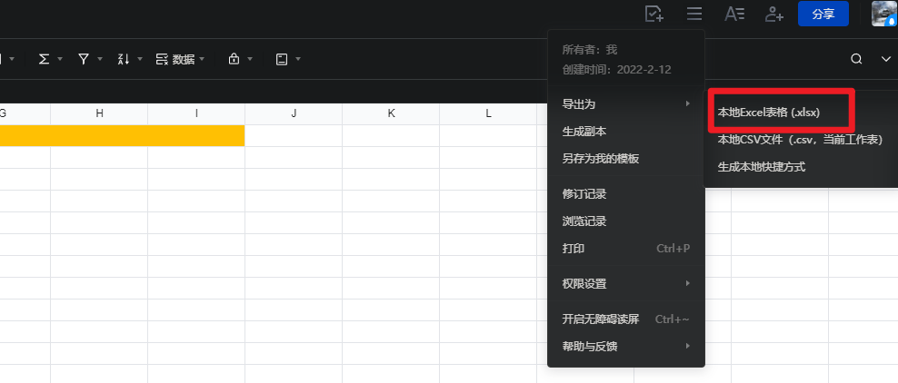
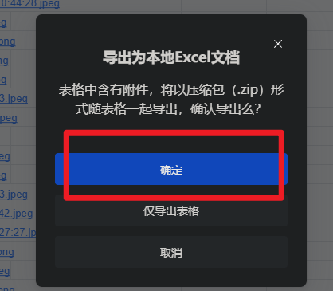
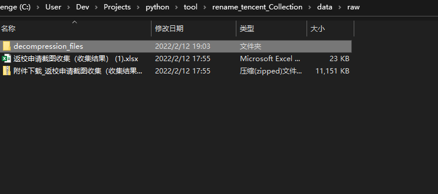
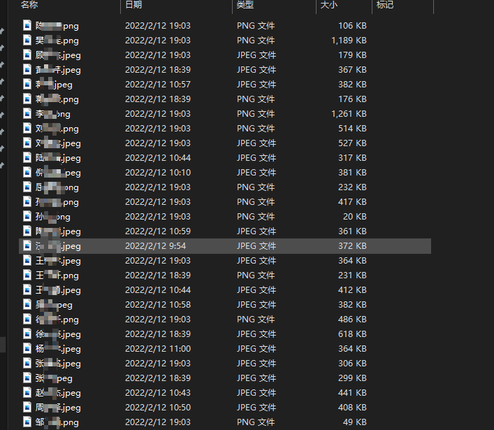
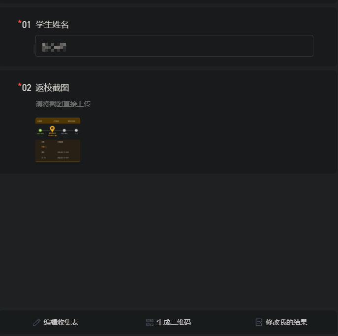

# Get_Tencent_Collection_Table
将此小脚本与腾讯收集表相结合使用即可完成对班级或者公司事务截图等附件收集并自动按照一定的要求命名。自己折腾着玩的，如果你觉得有用请点亮一个小星星。笔者非计算机专业，很多地方不专业欢迎批评指正。

# 实现思路

## v1.00

腾讯文档收集表可以链接到在线表格将被收集者的基本信息导出，如上传者的昵称，时间，填写的信息（学生姓名），上传的附件（会以zip的形式导出），但是文件并不会被根据填写的信息命名如学生姓名而是以时间加昵称的形式命名，如下图所示：

xlsx中表格导出：

这将不利于我们一些收集上交，如对每个截图命名，因此我考虑写一个py脚本可以根据表格内容自动给文件重新命名根据被收集者填写的信息，如上图中的“学生姓名（必填）”一栏。

# 使用方法

## V1.00

### 基本运行环境说明

此小脚本需要pandas 、os库即可，笔者使用pycharm编写所以会有一个.ide文件夹，如果您也是使用的pycharm那么直接打开工程将会让您非常舒适。

### 腾讯文档配置

设计收集表如更新日志中V1.00中所示。并导出收集表，如下图所示：

### 将导出的文件放到指定文件夹目录下

将下载的zip和xlsx放到指定的目录下，即 Get_Tencent_Collection_Table\data\raw 下：

然后运行main函数即可。下载的文件将会被自动解压到目录 Get_Tencent_Collection_Table\data\raw\decompression_files 下，并将文件命名为“学生姓名（必填）”一栏下的名称，对号入座。结果如下：

### 舒适的bat

为了更好舒适的体验，笔者自己写了一个小bat，但是应注意为了这个bat在我的toplab上哪里都能用，所以我使用了绝对地址，因此您需要更改为您main.py所在的地址，或者使用相对路径（这样bat就只能在指定文件夹下用了）。我像应该有更高级的方法，但是我实在折腾不动了，何况这个玩意花了我大半天的时光，着实上头。

### 注意

整个脚本程序中我认为最蛋疼的就是路径问题，尽管我已经避免使用绝对路径以保证工程的可移植性但是难免还会有一些潜在的问题，具体的可能发动您的主管能动性了。

# 更新日志

## v1.00

  目前已经完成了手动从腾讯文档收集表批量导出的zip文件和xlsx文件进行按照要求命名，且利用简单pandas导入一个名单以验证未上交的同志名单，该部分功能并不是很完善需要您自己做简单调试使用。

目前只能完成对姓名加附件的形式进行命名附件，收集表的样式应如下：

”学生命名“对话框您可以在设计表格的时候更改，但是更改后需要微调程序中对应读取xlsx中“学生命名”程序片段。

考虑下次加入网络部分，直接根据在线表格网址整个爬取下来并自动命名。但是就不知道什么时候有空，今天都折腾了我半天哈哈哈。

在1.00环节更可能的更新出多样的表格吧，比如键入学号等。

